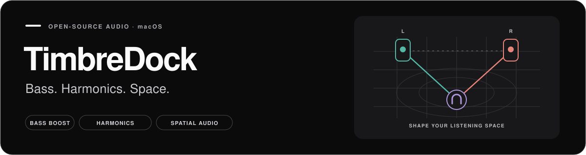

<picture>
  <source media="(prefers-color-scheme: dark)" srcset="docs/assets/hero-dark.svg">
  <source media="(prefers-color-scheme: light)" srcset="docs/assets/hero-light.svg">
  
</picture>

  <strong>Add bass weight, harmonic texture, and headphone space to your Mac.</strong> 
  Open-source DSP for system-wide or per-application audio, in real time.

  <a href="https://github.com/Gomtanga/timbredock/releases/download/v0.3.0/LowEnd-Native-Audio-macOS-v0.3.0.zip"><strong>Download for macOS ↗</strong></a> ·
  <a href="#quick-start">Quick start</a> ·
  <a href="#documentation">Documentation</a> ·
  <a href="https://github.com/Gomtanga/timbredock/releases/tag/v0.3.0">v0.3.0 release notes</a>

[한국어](README.md) · **English**

> **TimbreDock v0.4.0 is in development** — the new name for LowEnd Circuit. This branch updates the UI, English/Korean localization and signal analysis. Downloads and existing screenshots below describe stable v0.3.0. [Redesign and acceptance criteria](docs/redesign-v0.4.0.md) · [v0.4.0 guide](docs/timbredock-v0.4.0-guide.en.md) · [Build the new source](docs/development.en.md)

## Shape your sound and your listening space

**LowEnd Native Audio**, the macOS app from **LowEnd Circuit**, processes music, browser audio, and games before sending them to your current output device. Shape the bass, add harmonics, and position virtual speakers and the listener to adjust headphone space.

You can use **Bluetooth wireless earbuds** as well as wired headphones. Connect your earbuds to your Mac, select them as the macOS output device, then apply system-wide or per-application audio processing.

Spatial Stage · Actual app interface with direct control of speaker and listener positions

| Bass and texture | Space and signal insight |
|---|---|
| **Circuit** — Shape bass weight and saturation texture with LowEnd and Body. | **Spatial Stage** — Adjust speaker width, listener position, distance gain, and crossfeed. |
| **HighExciter** — Generate and blend harmonics from high-frequency content, with internal nonlinear-stage oversampling. | **Analysis** — Inspect the signal with a real-time spectrum, Peak, RMS, and Crest Factor. |

Spatial Stage is a geometry-based stereo processor. It does not provide individualized HRTF rendering or room reverb.

### A few controls. Your own sound.

Start with Circuit **IEM · Gentle · LowEnd · Deep · Clear** or HighExciter **Soft · Air · Detail · Shimmer · Off**, then adjust the details. Presets can differ in loudness, so compare output levels as well as tone.

Circuit · Model selection, bass controls, and presets in one view

## Download and start listening

| Supported system | App |
|---|---|
| **macOS 14.4 or newer · Apple Silicon** | [Download LowEnd Native Audio v0.3.0 ZIP](https://github.com/Gomtanga/timbredock/releases/download/v0.3.0/LowEnd-Native-Audio-macOS-v0.3.0.zip) |

1. Extract the ZIP and move **LowEnd Native Audio.app** to **Applications**.
2. Open the app and allow macOS **system-audio recording** permission.
3. Start with **Circuit → IEM or Gentle**, or **HighExciter → Soft or Air**.
4. Press the **speaker button at the bottom left (전체 시스템 적용 / Apply System-wide)**, then play music.

The app is **ad-hoc signed and not notarized by Apple**. If macOS blocks the first launch, check its source, then use **System Settings → Privacy & Security → Open Anyway**. See [Getting started](docs/getting-started.en.md) for installation and per-application processing. The current app interface uses Korean labels.

**Run only one copy of the app.** Disable exclusive output in players such as TIDAL, and press **중지 (Stop)** before changing output devices.

## Common questions

<strong>Are HighExciter oversampling and PCM Oversampling 2× the same feature?</strong>

They act at different points. HighExciter oversamples its nonlinear harmonic-generation stage and returns to the processing rate. Output Conditioning PCM 2× raises the output rate after tonal and Spatial processing. You can use both together. Supported devices can output at 44.1 → 88.2 kHz or 48 → 96 kHz.

<strong>Why does headroom leave the volume unchanged? Do I need an external DAC?</strong>

Headroom affects audio only while **PCM 2× is actually active**. Check the active status as well as the selected setting. An external DAC is optional; a built-in output can work if it supports the target rate. See the [Audio guide](docs/audio-guide.en.md) for the conditions.

<strong>Does Clean turn off all processing?</strong>

Clean bypasses the Circuit and HighExciter tonal models. Spatial and Output Conditioning operate independently; turn them off separately for a dry comparison.

<strong>What should I check if applying processing produces silence?</strong>

Check for another running copy of the app, system-audio recording permission, and the selected output device. Disable the player's exclusive mode, then **Stop → apply again**. For per-application capture, start playback in the target app first. Follow the checks in [Getting started](docs/getting-started.en.md).

## Explore the documentation

| Guide | Find out about |
|---|---|
| [Getting started](docs/getting-started.en.md) | Downloads, permissions, system-wide and per-app use, silence checks |
| [Audio guide](docs/audio-guide.en.md) | Models, preset values, PCM 2×, headroom, Source, and Rate Match |
| [Development](docs/development.en.md) | Building from source, verification commands, Swift/C++ architecture, design references |
| [Contributing](CONTRIBUTING.md) | Useful bug reports and change proposals |
| [Release notes](https://github.com/Gomtanga/timbredock/releases) | Changes and verification scope for each version |

Source information depends on available evidence. **Automatic Rate Match is experimental and off by default.** Live Output Conditioning supports **PCM 2×**. The audio and development guides cover the conditions and experimental scope.

## Build with us

Report bugs and ideas in [GitHub Issues](https://github.com/Gomtanga/timbredock/issues). For code contributions, start with [Development](docs/development.en.md) and [Contributing](CONTRIBUTING.md). This repository develops both the macOS app and a portable C++ DSP core.

Released under [GNU AGPL-3.0-or-later](LICENSE). This is an original DSP design, without manufacturer affiliation or claims of exact proprietary-circuit reproduction. Third-party names and trademarks belong to their respective owners.
