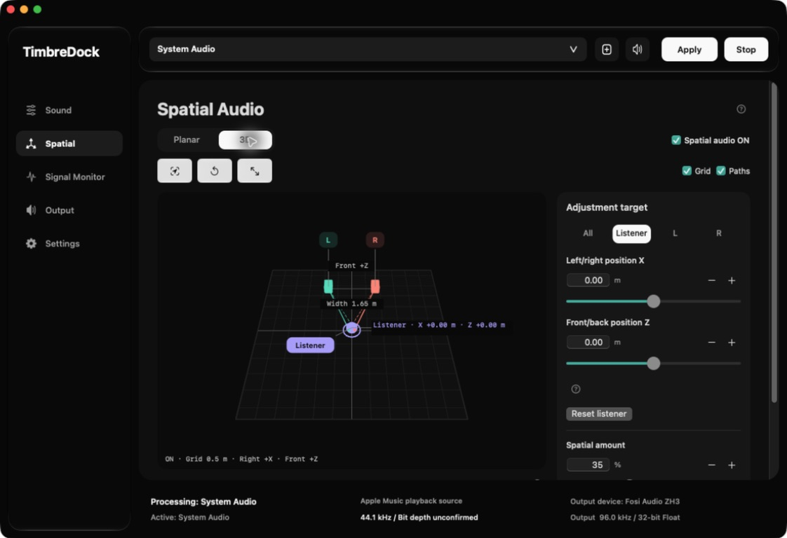

<picture>
  <source media="(prefers-color-scheme: dark)" srcset="docs/assets/hero-dark.svg">
  <source media="(prefers-color-scheme: light)" srcset="docs/assets/hero-light.svg">
  
</picture>

<p align="center">
  <strong>Mac의 소리를 내 취향과 공간에 맞게.</strong><br>
  전체 시스템 또는 선택한 앱에 저역, 배음, 스테레오 공간 처리를 적용하는 오픈소스 macOS 앱.
</p>

<p align="center">
  <a href="https://github.com/Gomtanga/timbredock/releases/download/v0.4.0/TimbreDock-v0.4.0-macOS-arm64.zip"><strong>TimbreDock v0.4.0 다운로드</strong></a> ·
  <a href="#features">기능</a> ·
  <a href="#quick-start">빠른 시작</a> ·
  <a href="#documentation">문서</a>
</p>

<p align="center">
  <a href="https://github.com/Gomtanga/timbredock/releases/latest"></a>
  <a href="https://github.com/Gomtanga/timbredock/actions/workflows/macos-native-ci.yml"></a>
  <a href="https://github.com/Gomtanga/timbredock/actions/workflows/cross-platform-core-ci.yml"></a>
  <a href="LICENSE"></a>
</p>

**한국어** · [English](README.en.md)

> **v0.4.0 정식 릴리스** — Apple Silicon Mac용 [ZIP 다운로드](https://github.com/Gomtanga/timbredock/releases/download/v0.4.0/TimbreDock-v0.4.0-macOS-arm64.zip) · [릴리스 정보](https://github.com/Gomtanga/timbredock/releases/tag/v0.4.0). 이전 버전인 **LowEnd Native Audio v0.3.0**도 [기존 릴리스](https://github.com/Gomtanga/timbredock/releases/tag/v0.3.0)에서 받을 수 있습니다. [후보 검증 결과와 남은 범위](docs/release-candidate-v0.4.0.md)

<a id="features"></a>

## 하나의 앱에서 소리와 공간을 조절합니다

TimbreDock는 macOS의 오디오를 출력 장치로 보내기 전에 처리합니다. **시스템 오디오(System Audio)** 경로로 대부분의 시스템 소리를 다루거나, 실행 중인 앱 하나를 선택할 수 있습니다. 사운드, 공간 음향, 출력은 독립적으로 설정하며 처리 중에도 효과 값을 조절할 수 있습니다.


<p align="center"><sub>v0.4.0 Sound 화면 · 오디오를 재생하지 않은 상태에서 만든 UI 이미지</sub></p>

| 화면 | 할 수 있는 일 |
|---|---|
| **사운드(Sound)** | 저음 강화(Bass Boost)로 저역의 양과 두께를, 고음 배음(Treble Harmonics)으로 배음 생성 강도와 추가량을 조절합니다. 끄기(Off)는 톤 모델만 우회합니다. |
| **공간 음향(Spatial)** | 평면 또는 3D 화면에서 가상 스피커 폭과 청취자 위치를 옮기고 공간 처리량을 조절합니다. |
| **신호 모니터(Signal Monitor)** | 처리된 신호의 상대 주파수 분포와 Peak, RMS, Crest를 확인합니다. 청취 음압이나 true peak 측정값은 아닙니다. |
| **출력(Output)** | Standard, 실험적 PCM 2× 업샘플링, 실험적 Match Source Sample Rate 중 하나를 선택합니다. |
| **설정(Settings)** | 영어 또는 한국어를 선택하고 진단 정보를 확인합니다. 언어 변경은 앱을 완전히 종료한 다음 실행할 때 반영됩니다. |



<p align="center"><sub>v0.4.0 후보 앱의 실제 Spatial 3D 화면 · 영어 UI에서 촬영</sub></p>

Spatial은 거리, 시간차, 크로스피드를 이용하는 스테레오 처리입니다. 개인화 HRTF나 방 리버브를 제공하지 않습니다. [조절 방법 보기](docs/timbredock-v0.4.0-guide.md)

<a id="quick-start"></a>

## 다운로드와 빠른 시작

| 버전 | 앱 이름 | 받는 방법 |
|---|---|---|
| **v0.4.0 (최신 릴리스)** | TimbreDock | [macOS arm64 ZIP 다운로드](https://github.com/Gomtanga/timbredock/releases/download/v0.4.0/TimbreDock-v0.4.0-macOS-arm64.zip) · [SHA-256 확인](https://github.com/Gomtanga/timbredock/releases/download/v0.4.0/SHA256SUMS.txt) · [사용 안내](docs/timbredock-v0.4.0-guide.md) |
| **v0.3.0 (이전 버전)** | LowEnd Native Audio | [기존 릴리스 페이지](https://github.com/Gomtanga/timbredock/releases/tag/v0.3.0) · [기존 설치 안내](docs/getting-started.md) |

배포 앱의 대상은 **macOS 14.4 이상을 실행하는 Apple Silicon Mac**입니다. Intel Mac이나 Windows용 앱은 제공하지 않습니다. v0.4.0 소스를 빌드하려면 **Xcode 26과 macOS 26 SDK 이상**이 필요합니다.

v0.4.0 TimbreDock 앱을 실행한 뒤에는 다음 순서로 시작하세요.

1. macOS에서 사용할 출력 장치를 선택하고 TimbreDock의 **시스템 오디오 녹음 권한**을 허용합니다.
2. 상단에서 **시스템 오디오(System Audio)** 항목을 선택하거나 **앱 선택(Choose app…)** 버튼으로 실행 중인 앱을 고릅니다.
3. **사운드(Sound)** 화면에서 저음 강화 또는 고음 배음을 선택하고 낮은 설정부터 조절합니다.
4. **적용(Apply)** 버튼을 누르고 상단의 실제 처리 상태와 출력 장치를 확인합니다. 대상 앱을 바꿨다면 다시 적용을 누릅니다.
5. 출력 장치를 바꾸거나 처리를 끝낼 때는 **중지(Stop)** 버튼을 누르고 중지 및 장치 샘플레이트 복원 상태를 확인합니다.

Mac 내장 출력, 유선 헤드폰, **Bluetooth 무선 이어폰**을 macOS 출력 장치로 사용할 수 있습니다. 외장 DAC는 필수가 아닙니다. 다만 무선 코덱, 지연 시간, 지원 샘플레이트는 장치마다 다르고, 모든 장치가 2× 출력을 지원하지는 않습니다. v0.4.0의 무선 장치별 실기기 검증 범위는 [후보 보고서](docs/release-candidate-v0.4.0.md)에 기록했습니다.

앱은 한 번에 하나만 실행하세요. 플레이어의 독점 출력 모드는 macOS 처리 경로를 우회할 수 있습니다. 앱에는 애드혹 서명이 적용되었으며 Apple의 공증은 받지 않았습니다. macOS가 첫 실행을 막으면 출처를 확인한 뒤 [설치 안내](docs/getting-started.md)의 절차를 따르세요.

## 출력과 측정값을 읽는 법

```text
재생 앱 → macOS 오디오 캡처 → 사운드 → 공간 음향 → 출력 → 선택한 출력 장치
                                              └─ 신호 모니터
```

- 사운드에서 **끄기(Off)** 모드를 선택해도 공간 음향과 출력은 각자 동작합니다. 원본과 비교하려면 공간 음향을 끄고 출력을 Standard로 설정하세요.
- Treble Harmonics의 **Harmonic Oversampling**은 배음을 만드는 내부 구간에 적용됩니다. Output의 **2× Upsampling**은 톤·Spatial 처리 후 출력 샘플레이트를 올립니다. 두 기능의 역할은 다릅니다.
- **Upsampling Gain**은 PCM 2× 출력이 실제로 활성 상태일 때만 신호 레벨을 낮춥니다. 저장된 값만으로 감쇠하지 않으며, 리미터도 아닙니다.
- 신호 모니터는 사운드, 공간 음향, 출력 뒤에서 재생 페이드와 장치 볼륨 앞의 신호를 보여 줍니다. 수치를 실제 청취 음압으로 해석하지 마세요.

Treble의 처리 대역과 강도 곡선 개선은 **v0.4.1 계획**입니다. 현재 v0.4.0에서는 입력의 고역 성분이 적으면 변화가 작게 들릴 수 있습니다. [측정과 확인 범위](docs/validation-v0.4.0-language-treble.md)

<a id="documentation"></a>

## 문서와 개발

| 문서 | 내용 |
|---|---|
| [v0.4.0 사용 안내](docs/timbredock-v0.4.0-guide.md) | 다섯 화면, 프리셋, 출력 모드, 언어 변경, 문제 해결 |
| [릴리스 후보 검증](docs/release-candidate-v0.4.0.md) | 실제 장치, UI, CI 결과와 아직 확인하지 못한 범위 |
| [v0.3.0 설치 안내](docs/getting-started.md) | 이전 버전의 설치와 권한 설정 |
| [개발 가이드](docs/development.md) | 소스 빌드, 오프라인 검사, Swift·C++ 구성 |
| [기여 안내](CONTRIBUTING.md) | 이슈에 포함할 정보와 변경 제안 방법 |

macOS 앱은 `SystemAudioProcessor/`의 Swift·C 엔진으로 동작합니다. `Source/Core/`에는 별도로 시험할 수 있는 C++ DSP 코어가 있으며, 이 저장소가 Windows 앱을 배포한다는 뜻은 아닙니다. v0.4.0 소스에서 앱을 빌드하려면 다음 명령을 사용하세요. 전체 요구 사항과 검증 명령은 [개발 가이드](docs/development.md)에 있습니다.

```sh
./scripts/build-native-system-audio-app.sh
```

문제 제보와 기능 제안은 [GitHub Issues](https://github.com/Gomtanga/timbredock/issues)에 남겨 주세요. 이 프로젝트는 [GNU AGPL-3.0-or-later](LICENSE)로 배포합니다. 독자적으로 설계한 DSP이며 특정 제조사와 제휴하거나 독점 회로를 정확히 재현한다고 주장하지 않습니다.
