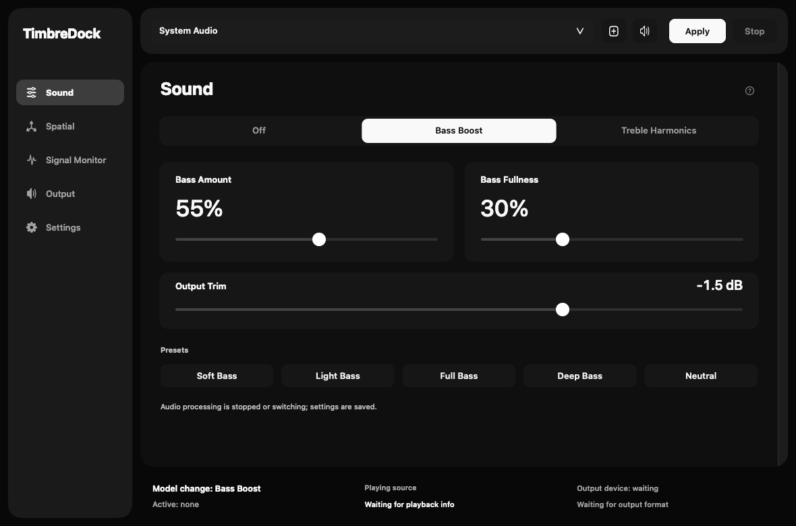
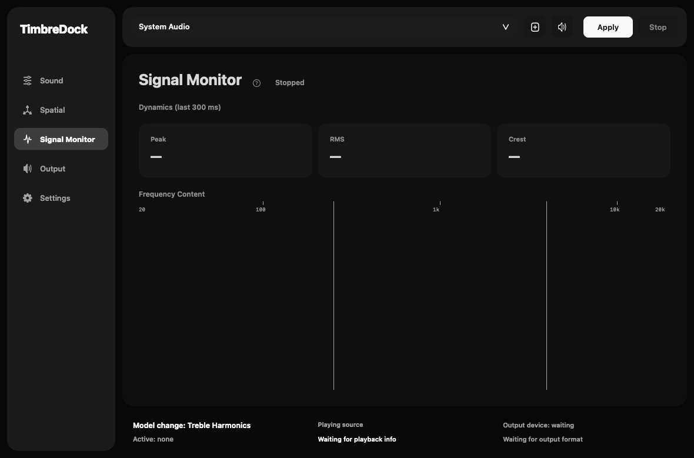

# TimbreDock v0.4.0 guide

The screenshots below come from the 2026-09-23 release-candidate build (1bf8fed), which includes the monochrome Liquid Glass styling and `?` contextual help. See the [UI design record](ui-design-v0.4.0.md) and [Liquid Glass record](liquid-glass-v0.4.0.md) for layout rationale and verification scope.

[한국어](timbredock-v0.4.0-guide.md) · [Redesign specification](redesign-v0.4.0.md)

This guide describes the v0.4.0 release-candidate build. It has not been published as a formal release; v0.3.0 LowEnd Native Audio remains the published stable version, covered by the [previous getting-started guide](getting-started.en.md). Device listening, transition and other final acceptance items are tracked separately.

The images below are offline UI renderings. Processing was not started and the Signal Monitor has no live measurements. Actual Liquid Glass material and SceneKit compositing are verified separately.

## Start processing

English is the default, regardless of the system language. Select Korean in **Settings → Language** to use it on the next launch. Selecting a language does not restart playback.

1. Choose your macOS output device and start playing music.
2. Select **System Audio** in the header, or choose a running application from the target menu or **Choose app…**.
3. Open **Sound**, choose **Bass Boost** or **Treble Harmonics**, and start with modest settings.
4. Press **Apply** and check the actual processing state and output device. Editing the target takes effect only after another Apply.
5. Press **Stop** before changing devices or quitting, and check that processing has stopped and rate restoration has completed.

Models and effects remain editable while processing. Off bypasses only the tone model. Disable Spatial and select Standard output as well when comparing with the original signal.

Built-in output, wired headphones and wireless earbuds can use the macOS processing path. An external DAC is optional. Wireless codec, latency and sample-rate limits still apply, and not every device supports 2× output. Run only one instance of the app.

## Sound and Spatial

| Control | Purpose |
|---|---|
| Bass Amount / Bass Fullness / Output Trim | Bass level, body and the Bass Boost model's output level |
| Harmonic Drive / Added Harmonics | Harmonic generation strength and the amount added to the original signal |
| Spatial width / listener position / Amount | Stereo space using distance, timing and crossfeed |

Added Harmonics is additive; it does not remove the dry signal. Internal Harmonic Oversampling operates inside harmonic generation and is separate from Output's 2× conversion. Spatial is neither a personalized HRTF renderer nor room reverb.

Preset numbers are preserved under new names. Bass Boost offers Soft Bass / Light Bass / Full Bass / Deep Bass / Neutral. Treble Harmonics offers Subtle / Light / Medium / Strong / Off. Presets are not loudness matched.

## Output

Choose one Output Rate Mode at a time.

| Mode | Behavior |
|---|---|
| Standard | Requests neither 2× conversion nor source-driven device rate changes |
| 2× Upsampling (Experimental) | Converts 44.1→88.2 or 48→96 kHz on a supported device |
| Match Source Sample Rate (Experimental) | Attempts supported device rate changes based on verified source observations |

For 2×, **Upsampling Gain** ranges from −12 to 0 dB and defaults to −3 dB. It affects audio only while the actual 2× path is active. Check the saved value and actual state together. 0 dB applies no attenuation; −6 dB is approximately half amplitude. This control cannot undo saturation earlier in the chain and is not a limiter.

Short and Long select the conversion filter. Unsupported live features such as 4×/8×, DSD/DoP, dither and noise shaping are not selectable. Opening Advanced does not change the audio settings.

Device synchronization can cause silence during a rate transition. Read failure/restoration messages and use Stop to retry recovery. Missing or conflicting source observations can prevent automatic changes.

## Read the Signal Monitor

The measurement point is after Tone → Spatial → Output and before playback fade and device volume. It does not measure listening sound pressure.

- **Peak (dBFS)** is the largest absolute L/R sample in the trailing 300 ms. A 0 dBFS indication is sample full scale, not a true-peak or hearing-safety measurement.
- **RMS (dBFS)** uses mean stereo energy over the same 300 ms. A full-scale sine reads about −3.01 dBFS.
- **Crest (dB)** is Peak minus RMS for that same window. It is unavailable during silence.
- **Spectrum** shows relative frequency content from averaged left/right spectral power, using a fixed −96...0 display range without automatic normalization. Bass / Midrange / Treble are explanatory categories.

Measuring means the window is still filling. Silence means near-zero samples actually arrived; Waiting for audio means no new frames arrived for 250 ms. Frequencies below the FFT's available resolution, particularly at high sample rates, are marked separately.

## Upgrade and troubleshooting

Existing model and preset values are retained. Legacy Minimum Phase becomes Short, matching its previous effective algorithm. Unsupported saved output modes/factors become Standard with a notice. Valid saved 2× takes precedence if automatic source matching was also enabled.

The bundle identifier and capture-lock path are retained, but this does not guarantee macOS permission continuity after renaming. Grant capture permission if requested and avoid running LowEnd Native Audio alongside TimbreDock. For per-app silence, confirm playback has started and disable the player's exclusive output mode.

## Language and harmonics follow-up

Settings distinguishes the current interface language from the saved next-launch language. Fully quit with Command-Q and reopen to apply it. The Sound receipt line reports the model and two control values received by the audio callback; it does not establish audible effect strength. The unchanged Treble Harmonics algorithm can produce very small changes when high-frequency input energy is low. See the [follow-up verification record](validation-v0.4.0-language-treble.md).

[Release-candidate verification and remaining coverage](release-candidate-v0.4.0.md)
