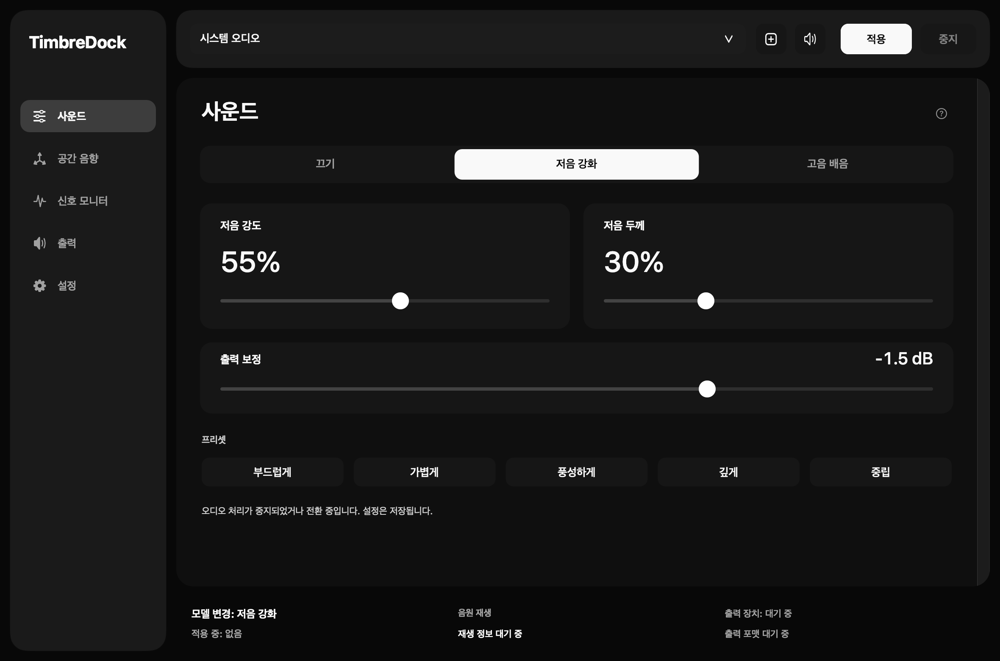
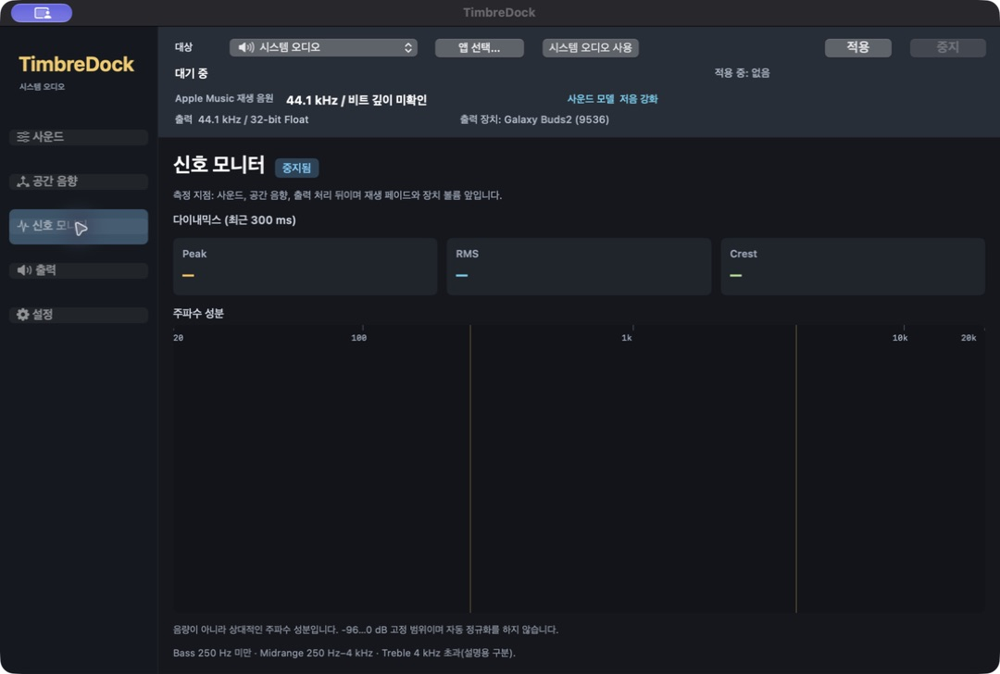

# TimbreDock v0.4.0 사용 안내

2026-09-23 릴리스 후보 빌드(8ab3a2d)의 최신 화면을 기준으로 작성했습니다. 흑백 중심의 Liquid Glass 스타일과 `?` 도움말 방식을 반영했습니다. 화면 배경과 적용 범위는 [UI 디자인 기록](ui-design-v0.4.0.md)과 [Liquid Glass 기록](liquid-glass-v0.4.0.md)에 있습니다.

[English](timbredock-v0.4.0-guide.en.md) · [개편 명세](redesign-v0.4.0.md)

이 문서는 v0.4.0 후보 빌드의 화면과 설정을 설명합니다. 아직 공식 릴리즈로 게시하지 않았고, 현재 배포되는 안정 버전은 v0.3.0 LowEnd Native Audio입니다. v0.3.0 사용법은 [기존 설치 안내](getting-started.md)에 있습니다. 기기별 청취·장치 전환 등 최종 승인 항목은 별도로 확인합니다.

아래 이미지는 오프라인 UI 렌더링입니다. 오디오 처리는 시작하지 않았고, 모니터 화면에는 실시간 측정값이 없습니다. 실제 Liquid Glass 재질과 SceneKit 합성 화면은 별도로 확인합니다.

## 시작하기

기본 언어는 영어입니다. **Settings → Language**에서 한국어를 선택하면 다음 실행부터 적용됩니다. 설정에는 현재 화면 언어와 다음 실행에 사용할 저장된 언어가 구분되어 표시됩니다. 창만 닫는 대신 ⌘Q로 완전히 종료한 뒤 다시 실행하세요. 언어를 선택해도 현재 재생은 재시작되지 않습니다.

1. macOS에서 사용할 출력 장치를 선택하고 음악 재생을 시작합니다.
2. 앱 상단에서 **System Audio**를 선택합니다. 특정 앱만 처리하려면 대상 메뉴 또는 **Choose App**에서 실행 중인 앱을 고릅니다.
3. **Sound**에서 **Bass Boost** 또는 **Treble Harmonics**를 선택하고 낮은 설정부터 조절합니다.
4. 상단 **Apply**를 누르고 실제 처리 상태와 출력 장치를 확인합니다. 대상 선택을 바꾼 뒤에는 다시 Apply를 눌러야 새 대상에 적용됩니다.
5. 종료하거나 출력 장치를 바꾸기 전에는 **Stop**을 누르고 중지·샘플레이트 복원이 완료됐는지 확인합니다.

처리 중에도 모델과 효과 값을 편집할 수 있습니다. Off는 톤 모델만 우회합니다. Spatial과 Output은 별도로 동작하므로 원본과 비교하려면 Spatial을 끄고 Output을 Standard로 설정하세요.

내장 출력, 유선 이어폰, 무선 이어폰에서도 macOS 출력 경로를 통해 처리할 수 있습니다. 외장 DAC는 필수가 아닙니다. 무선 연결의 코덱·지연·샘플레이트 제한은 그대로 적용되며, 모든 장치가 2× 출력을 지원하는 것은 아닙니다. 앱을 두 개 실행하지 마세요.

## Sound와 Spatial

| 화면 | 조절 항목 | 의미 |
|---|---|---|
| Bass Boost | Bass Amount / Bass Fullness / Output Trim | 저역의 양감과 두께, 이 모델의 출력 레벨 |
| Treble Harmonics | Harmonic Drive / Added Harmonics | 배음 생성 강도와 원래 신호에 더하는 배음의 양 |
| Spatial | 가상 스피커 폭 / 청취자 위치 / Amount | 거리·시간차·크로스피드를 이용한 스테레오 공간 조절 |

Treble Harmonics의 Added Harmonics는 원음을 줄이는 dry/wet 크로스페이드가 아닙니다. 이 모델 내부의 Harmonic Oversampling은 배음 생성 과정에만 적용되며, Output의 2× 출력 변환과 역할이 다릅니다. Spatial은 개인화 HRTF나 방 리버브가 아닙니다.

프리셋 값은 이전 버전과 같고 이름만 바뀌었습니다. Bass Boost는 Soft Bass / Light Bass / Full Bass / Deep Bass / Neutral, Treble Harmonics는 Subtle / Light / Medium / Strong / Off를 사용합니다. 프리셋 간 음량은 일치하도록 보정되어 있지 않습니다.

## Output

출력 모드는 동시에 하나만 사용합니다.

| 모드 | 동작 |
|---|---|
| Standard | 앱이 2× 변환이나 소스 추적에 따른 장치 샘플레이트 변경을 요청하지 않음 |
| 2× Upsampling (Experimental) | 지원되는 장치에서 44.1→88.2 또는 48→96 kHz로 변환 |
| Match Source Sample Rate (Experimental) | 확인된 소스 정보에 따라 지원되는 장치 샘플레이트로 전환 시도 |

2×에서 **Upsampling Gain**은 −12~0 dB이며 기본값은 −3 dB입니다. 실제 2× 경로가 활성 상태일 때만 소리에 반영됩니다. 저장된 값과 현재 적용 상태를 함께 확인하세요. 0 dB는 감쇠 없음, −6 dB는 진폭의 약 절반입니다. 이 값은 이미 앞단에서 발생한 포화를 되돌리지 않으며 리미터가 아닙니다.

Short와 Long은 출력 변환 필터 선택입니다. 4×/8×, DSD/DoP, 디더·노이즈 셰이핑 등 현재 실시간 출력에 연결되지 않은 기능은 선택 메뉴에 없습니다. Advanced를 펼치는 동작 자체는 오디오 설정을 바꾸지 않습니다.

샘플레이트 전환에는 장치 재동기화로 무음 구간이 생길 수 있습니다. 실패하거나 복원이 완료되지 않았다는 메시지가 나오면 실제 상태를 확인하고 Stop으로 복구를 시도하세요. 소스 정보가 없거나 서로 다른 소스가 섞이면 자동 변경을 보류할 수 있습니다.

## Signal Monitor 읽기

측정 위치는 Tone → Spatial → Output 이후이며, 재생 페이드와 장치 볼륨 이전입니다. 수치는 실제 청취 음압이 아닙니다.

- **Peak (dBFS)**: 최근 300 ms 동안 좌우 채널에서 가장 큰 샘플의 절댓값입니다. 0 dBFS 이상은 샘플 풀스케일 표시이며, true-peak 측정이나 청력 안전 판정이 아닙니다.
- **RMS (dBFS)**: 같은 300 ms 동안 두 채널의 평균 에너지로 계산한 레벨입니다. 풀스케일 사인파는 약 −3.01 dBFS입니다.
- **Crest (dB)**: 같은 구간의 Peak와 RMS 차이입니다. 순간 피크와 평균 에너지의 간격을 보여줍니다. 무음에서는 표시하지 않습니다.
- **Spectrum**: 좌우 채널의 주파수별 에너지를 평균한 상대 분포입니다. 고정된 −96~0 표시 범위를 쓰며, 자동으로 높이를 맞추지 않습니다. Bass / Midrange / Treble 구분은 이해를 돕는 범주입니다.

시작 직후 필요한 샘플이 쌓일 때는 Measuring으로 표시합니다. 실제 0에 가까운 샘플은 Silence, 250 ms 동안 새 샘플이 없으면 Waiting for audio로 구분합니다. 높은 샘플레이트에서 FFT 해상도가 부족한 저주파 구간은 측정 가능한 영역과 구별해 표시합니다.

## 이전 설정과 문제 해결

기존 모델·프리셋의 수치는 유지합니다. 저장된 Minimum Phase는 기존 실제 알고리즘과 같은 Short로 옮기며, 지원되지 않는 출력 모드·배수는 Standard로 전환하고 안내합니다. 2×와 자동 소스 추적이 동시에 저장되어 있었다면 유효한 2×를 우선합니다.

앱 번들 식별자와 캡처 잠금 경로는 유지하지만 이름 변경 후에도 macOS 권한이 유지된다고 보장할 수는 없습니다. 녹음 권한이 요청되면 허용하고, 이전 LowEnd Native Audio와 TimbreDock이 동시에 실행되지 않게 하세요. 특정 앱에 소리가 없으면 그 앱에서 재생 중인지, 독점 출력이 켜져 있는지 확인하세요.

## 언어·배음 후속 검증

한국어에서는 주요 사운드 조절 항목과 프리셋도 번역됩니다. Sound 모델 아래의 수신 표시는 실제 오디오 콜백에 전달된 모델과 두 조절값을 보여 줍니다. 수신 확인은 효과의 청감상 크기를 보장하지 않습니다. Treble Harmonics의 기존 알고리즘은 고역 입력 성분이 작으면 변화가 매우 작을 수 있습니다. 측정 조건과 실제 장치 검사 한계는 [후속 검증 기록](validation-v0.4.0-language-treble.md)을 참고하세요.
